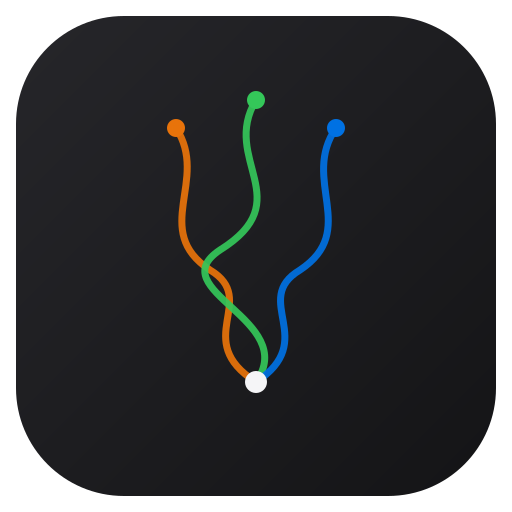

<div align="center">
  
  <h1>Moirai</h1>
  <p><b>一個人指揮，四個 AI 幹活。</b></p>
  <p>桌面版多視窗 AI 協作環境。不用 API key，直接驅動你已經在付費的 <code>claude</code> 與 <code>codex</code> CLI。</p>
</div>

---

## 這個工具在解什麼問題

你同時開了四個終端機跑 AI。四個都在動，你在四個之間複製貼上。

第一個問題是你看不見。哪一個卡住了、哪一個在鬼打牆、哪一個宣稱做完了但磁碟上什麼都沒變，你得一個一個切過去看。

第二個問題更貴。你自己就是那條線。A 的產出要給 B，只有你能搬。四個 agent 跑得再快，全部卡在你按不按那一下。

第三個問題最痛。你跟主要那個 AI 談了兩小時，脈絡都在它腦子裡，然後 context 滿了、被壓縮、它變得不像原本那個。你得重新解釋一次自己。

Moirai 就是為了這三件事做的。

---

## 核心特性

### 四個視窗，一個指揮位

四個獨立視窗，各自有自己的引擎、自己的對話、自己的模型與權限設定、自己的角色名稱。

按 `Tab` 切換發送目標，或選 `All` 一次送給全部。同一個問題丟給四個不同角色，四份答案並排出現，不用切分頁。

版面可切二窗或四窗。二窗模式下每一欄可以指定要顯示哪個視窗，另外兩個仍在背景運作。

### 角色，不只是名字

每個視窗可以命名（PM、Dev、Audit、QA，或任何你要的），並且設定「職責」。職責不是註解，它會真的被帶進那個視窗的任務描述裡。

交棒時送過去的不是對話逐字稿，是「下游自己的職責 + 上游結果當任務來源」。收到的人拿到的是一份任務，不是一段別人的聊天記錄。

### 照妖鏡：AI 說的 vs 磁碟上發生的

設定專案資料夾之後，每一輪都會拿 AI 宣稱做了什麼，去比對磁碟上實際變了什麼。

畫面上方直接標出來：

- `9 suspicious` — 宣稱動了檔案，但磁碟上找不到對應改動
- `Dev looping 5×` — 同一件事重複跑五次，在鬼打牆
- `1 consistent` — 說到做到

這一層不需要 AI 配合，它是從外面看。AI 沒辦法用漂亮的話術通過它。

### 共享內容池

四個視窗讀同一份共享池。某個視窗的產出會自動帶進其他視窗的下一輪，而且明確標示「這段是自動帶入的，不是使用者手打的」。

帶的是產出，不是對話逐字。所以下游拿到的是可用的結果，不是四份互相污染的聊天記錄。

共享內容同時鏡射成 `memory.md`，寫滿自動接續到 `memory-2.md`，四個視窗都知道有哪些檔案，需要更早的內容可以自己去讀。

### 成本與 token，看得見

每個引擎的近 24 小時花費、token 用量、cache 命中率，本地解析你自己的 session 記錄算出來，不上傳任何東西。

`Clear` 一鍵丟掉膨脹的 context，不再為了重新 cache 一份垃圾付錢。

### 你原本的 session，不是白紙

側邊欄直接列出你真實的 Claude 與 Codex 歷史，依專案分組（包含 Claude 桌面 App 的自訂群組），標題經過整理。任何一個都能直接接續，也可以開新的。

### 每個視窗獨立的 CLI 控制

模型、權限模式、推理強度、Fast mode，四個視窗各自設定，互不干擾。

選單直接對應 CLI 真正吃的參數，不是好看的假選項。

### 遠端執行

透過 `~/.ssh/config` 裡的主機，把某個視窗跑在另一台機器上。本機視窗跟遠端視窗可以並存在同一個畫面。

remote 參數走白名單，只接受 ssh config 裡實際存在的主機，並擋掉以 `-` 開頭的值，避免被當成 ssh 選項執行。

### 拖檔進來

從電腦上傳，或直接把檔案拖進輸入框，檔案會落進專案裡讓 agent 讀得到。單次上限十個。

---

## 跟 Code Duo 的差別

Moirai 的前身是 Code Duo，一個瀏覽器裡跑的兩視窗工具。這一代是重寫，不是改版。

| | Code Duo | Moirai |
|---|---|---|
| 形態 | 瀏覽器頁面 | macOS 桌面 App（Electron） |
| 後端 | Python 子行程 | Node.js，直接跑在 main process |
| 視窗數 | 2 | 4，可切二窗四窗 |
| 角色 | 固定 Claude / Codex | 可命名、可設職責、引擎可換 |
| 進程模型 | 跨語言跨進程 | 單進程，少一整層失敗點 |

後端從 Python 換成 Node 之後，整個跨語言那一層失敗點消失了，啟動與穩定度都是不同等級。

---

## 安裝

需要 Node 22 以上，以及你已經裝好並登入的 `claude` 或 `codex` CLI。

```bash
git clone https://github.com/norika1207-lab/Moirai-Code-Matrix
cd Moirai-Code-Matrix
npm install
npm start
```

只要跑後端不要桌面殼：

```bash
npm run server        # http://localhost:8765
```

打包成 .app / .dmg：

```bash
npm run build:mac
npm run build:dmg
```

---

## 沒有 API key

Moirai 不呼叫任何 API，也不需要你貼任何金鑰。它驅動的是你電腦上已經登入的 CLI，用的是你既有的 Max 或 ChatGPT 訂閱額度。

所有資料留在本機。session 記錄、成本統計、共享記憶，全部只在你自己的磁碟上。

---

## 路線圖

即將加入 Code Tree 的檔案樹繪製：把專案結構與改動過程視覺化，看得出誰動了哪裡、一次改動會波及多遠。

---

## 授權

MIT
