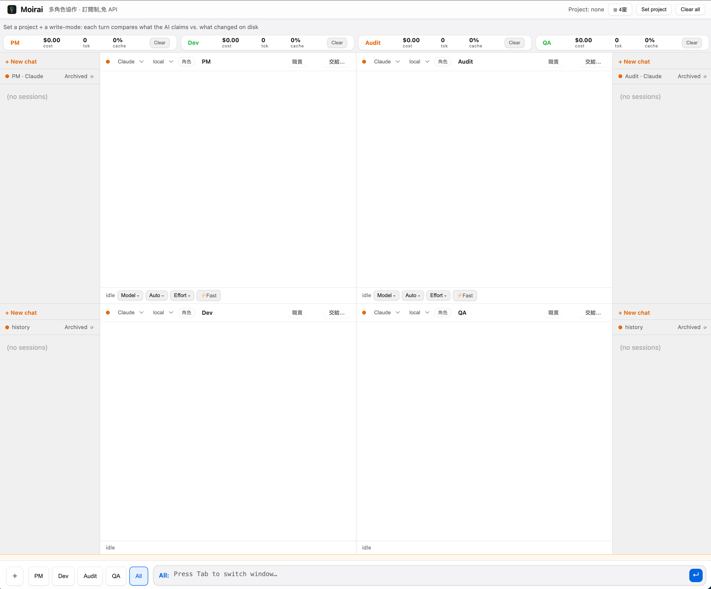
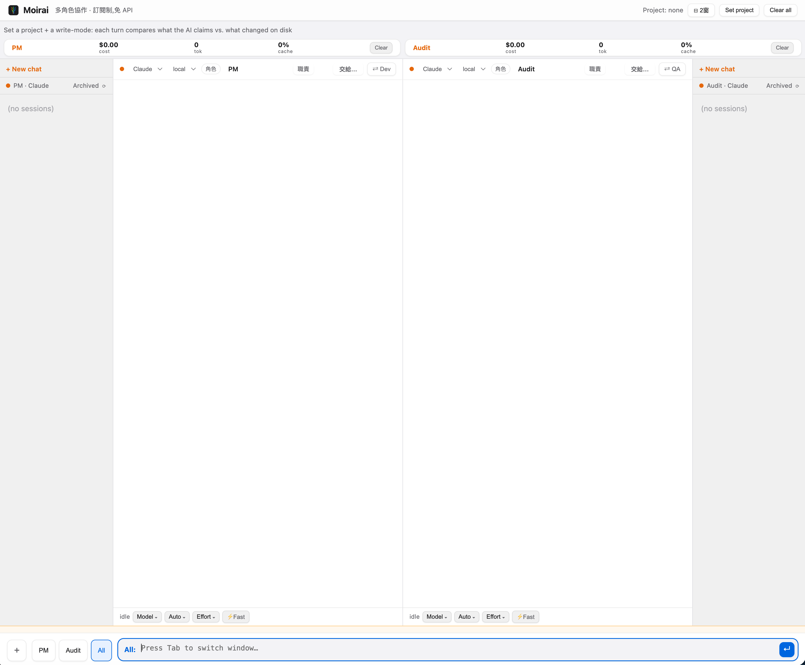

<div align="center">
  

  <h1>Moirai</h1>

  <p><b>One person commands. Four AI agents work.</b></p>

  <p>
    A desktop workspace where multiple AI coding agents run side by side,<br>
    hand work to each other, and get caught when they lie about what they did.
  </p>

  <p>
    <b>No API keys.</b> It drives the <code>claude</code> and <code>codex</code> CLIs you already pay for.
  </p>
</div>

<br>

<div align="center">
  
  <p><i>Four agents. Four roles. One command bar.</i></p>
</div>

<br>

---

## Why this exists

You already run four terminals with AI in them. Here is what actually happens.

**You can't see anything.** One agent is stuck. One is looping on the same file for the fifth time. One claims it shipped a feature and changed nothing on disk. To find out, you tab through all four.

**You are the wire.** Agent A's output has to reach Agent B, and only you can carry it. Four agents running at full speed all bottleneck on whether you click a button.

**Your main session dies.** Two hours of context lives in one conversation. Then the window fills, it compacts, and the thing you were talking to is no longer the thing you were talking to. You explain yourself from scratch.

Moirai is built for those three problems specifically.

---

## What it does

### Four windows, one command position

Four independent panes. Each has its own engine, its own conversation, its own model, its own permission mode, its own name.

Hit `Tab` to aim at a window, or pick `All` to broadcast. Four answers to the same question land side by side, no tab switching.

Switch between two-window and four-window layouts. In two-window mode you choose which panes are visible; the others keep running in the background.

<div align="center">
  
  <p><i>Two-window mode. The other two panes keep working behind it.</i></p>
</div>

### Roles that mean something

Name a window PM, Dev, Audit, QA, or anything else, and give it a written role brief. The brief is not a comment. It gets carried into that window's task framing.

When work is handed forward, what travels is **the receiving window's own role brief plus the upstream result as source material** — not a transcript. The next agent gets an assignment, not somebody else's chat log.

### A lie detector for AI claims

Point Moirai at a project folder and every turn gets checked: what the AI *said* it did, against what *actually changed on disk*.

The verdict sits at the top of the screen:

| Badge | Meaning |
|---|---|
| `9 suspicious` | Claimed file changes that don't exist on disk |
| `Dev looping 5×` | Same work repeated five times — it's stuck in a circle |
| `1 consistent` | Said it, did it |

This layer doesn't need the AI's cooperation. It looks from the outside. Confident prose does not get past it.

### A shared pool, not four isolated silos

All four windows read the same shared pool. One window's output is automatically carried into the others' next turn, clearly marked as *injected, not typed by the user*.

What travels is **results, not transcripts** — so downstream agents get something usable instead of four mutually polluting chat logs.

The pool is mirrored to `memory.md`, rolling over to `memory-2.md` when full. Every window knows which files exist and can read further back on its own.

### Cost you can actually see

Per-engine spend, token usage, and cache hit rate for the last 24 hours — parsed locally from your own session records. Nothing is uploaded.

One-click `Clear` drops a bloated context so you stop paying to re-cache garbage.

### Your real sessions, not a blank slate

The sidebar lists your actual Claude and Codex history, grouped by project — including Claude Desktop's custom groups — with cleaned-up titles. Resume any of them or start fresh.

### Per-window CLI controls

Model, permission mode, reasoning effort, Fast mode. Each window independently.

The menus map to what the CLI actually accepts. No decorative options that silently fail.

### Remote execution

Run any window on another machine through your `~/.ssh/config` hosts. Local and remote panes coexist in the same view.

The `remote` value is allowlisted against your ssh config and rejected if it starts with `-`, so it can never be parsed as an ssh option.

### Drag files in

Upload from disk or drop a file straight into the composer. It lands in the project where the agent can read it. Ten files per batch.

---

## Moirai vs Code Duo

Moirai's ancestor was **Code Duo**, a two-pane tool that ran in a browser tab. This is a rewrite, not a version bump.

|  | Code Duo | Moirai |
|---|---|---|
| Form | Browser page | macOS desktop app (Electron) |
| Backend | Python subprocess | Node.js, in the Electron main process |
| Windows | 2 | 4, switchable to 2 |
| Roles | Fixed Claude / Codex | Named, briefed, engine-swappable |
| Process model | Cross-language, cross-process | Single process |

Moving the backend from Python to Node removed an entire class of failure that lived in the language boundary. Startup and stability are not in the same league.

---

## Install

Requires Node 22+ and the `claude` or `codex` CLI already installed and logged in.

```bash
git clone https://github.com/norika1207-lab/Moirai-Code-Matrix
cd Moirai-Code-Matrix
npm install
npm start
```

Backend only, no desktop shell:

```bash
npm run server        # http://localhost:8765
```

Package as .app / .dmg:

```bash
npm run build:mac
npm run build:dmg
```

---

## No API keys, ever

Moirai calls no APIs and asks for no keys. It drives the CLIs already authenticated on your machine, spending the Max or ChatGPT subscription you already have.

Everything stays local. Session records, cost stats, shared memory — all of it lives on your own disk.

---

## Roadmap

**Code Tree file-tree visualization** — see the project's structure and how it changes over time: who touched what, and how far a single edit ripples.

---

## License

MIT
